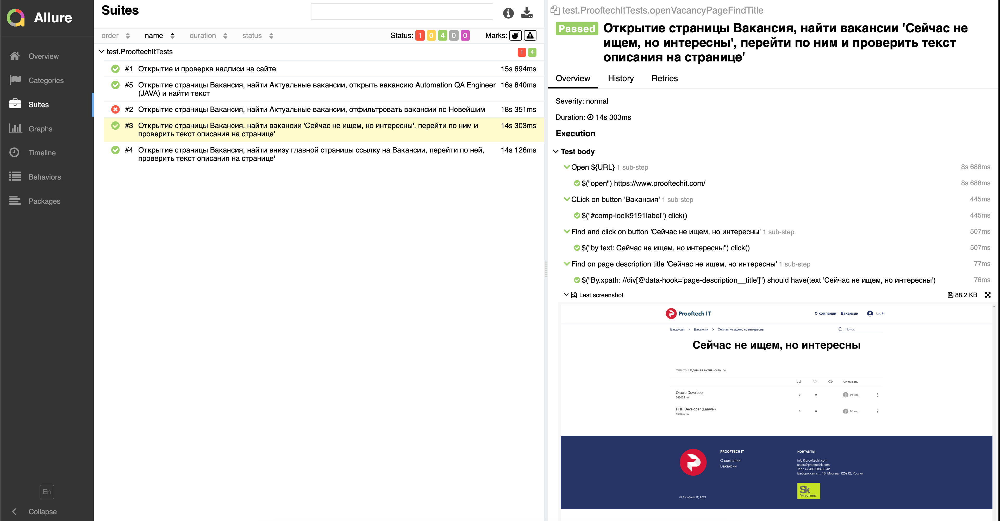
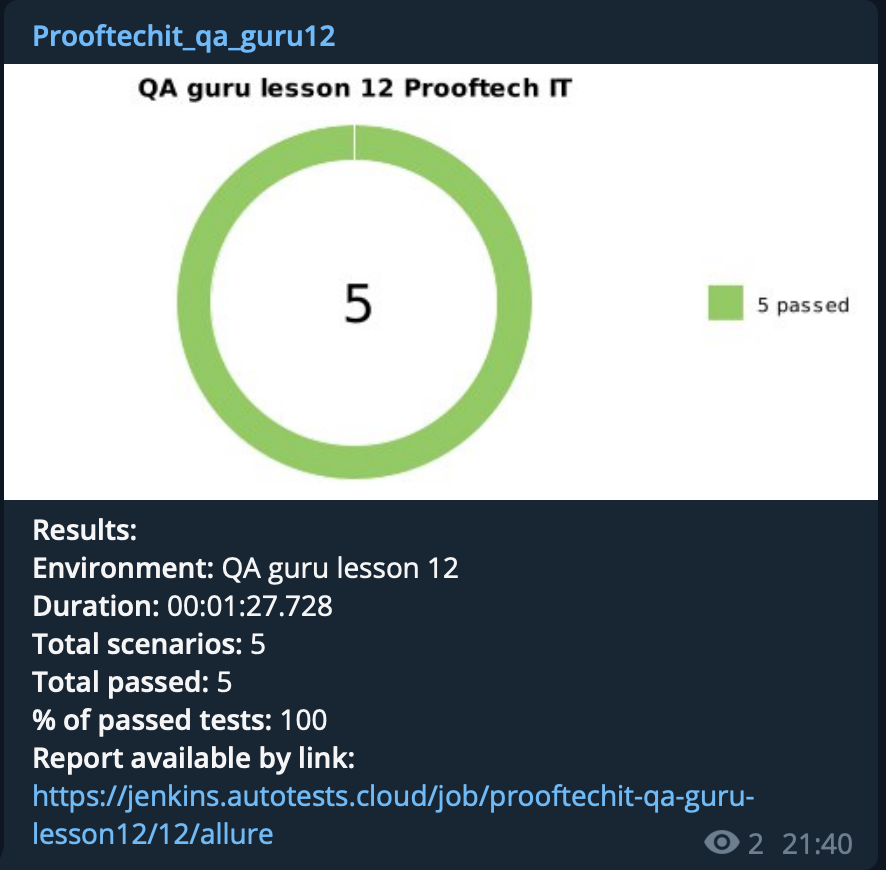

# Автотесты для проверки работоспособности сайта и внутреннего функционала [**Prooftech IT**](https://www.prooftechit.com)
___Или по ссылке ниже:___
```bash
https://www.prooftechit.com
```
---------
## Содержание
1. [Стек и инструменты](#стек-и-инструменты)
2. [Запуск через Jenkins](#запуск-через-Jenkins)
3. [Запуск тестов из командной строки и формирование отчета в Allure](#запуск-тестов-из-командной-строки-и-формирование-отчета-в-Allure) 
4. [Запуск и прогон тестов в Selenoid](#запуск-и-прогон-тестов-осуществляется-в)
5. [Отчет в Allure](#после-запуска-и-прогона-тестов-формируется-отчет-в-Allure)
6. [Уведомления в Telegram](#формируется-уведомление-в-Telegram-с-результатами)
7. [Контакты](#Контакты)

---------
<!-- toc -->
## Стек и инструменты
Тесты написаны на Java + JUnit5 + Selenide + Gradle, запуск и прогон тестов через Jenkins + Selenoid с отчетами в Allure + Telegram

| Java | Gradle | Junit5 | Selenide | Jenkins | Selenoid |Allure Report | Telegram |
|:----:|:------:|:------:|:--------:|:-------:|:--------:|:------------:|:--------:|
|  |  |  |  |  |  |  |  |

---------
## Запуск через Jenkins

### Список параметров для запуска тестов в [**Jenkins**](https://jenkins.autotests.cloud/job/prooftechit-qa-guru-lesson12/):
___Или по ссылке ниже:___
```bash
https://jenkins.autotests.cloud/job/prooftechit-qa-guru-lesson12/
```
* browser (по умолчанию chrome)
* browserVersion (по умолчанию 89.0)
* browserSize (по умолчанию 1920x1080)
* SELENOID_URL (url адрес selenoid)
* videoStorage (url address с видео)
* threads (количество threads)

### Скриншот страницы с выбором параметров сборки


---------
## Запуск тестов из командной строки и формирование отчета в Allure

- Запуск тестов с указанными параметрами:

    - Для Windows:
        ```bash
        gradle clean -DselenoidUrl=selenoid.autotests.cloud -DvideoStorage=https://selenoid.autotests.cloud/video/ -Dthreads=1 test
        ```
    - Для MacOS:
        ```bash
        ./gradlew clean -DselenoidUrl=selenoid.autotests.cloud -DvideoStorage=https://selenoid.autotests.cloud/video/ -Dthreads=1 test
        ```

- Формирование отчета в Allure:
```bash
allure serve build/allure-results
```
---------
## Запуск и прогон тестов осуществляется в [**Selenoid**](https://selenoid.autotests.cloud/#/)
___Или по ссылке ниже:___
```bash
https://selenoid.autotests.cloud/#/
```
### Пример прогона теста в Selenoid


---------
## После запуска и прогона тестов формируется отчет в Allure


Внутри отчета можно увидеть полезную информацию такую как: логи, скриншоты и видео прохождения каждого теста:



---------
## Формируется уведомление в Telegram с результатами


___Или по ссылке ниже, где ```{NUMBER_FOR_JENKINS_BUILD}``` номер билда в Jenkins:___
```bash
https://jenkins.autotests.cloud/job/prooftechit-qa-guru-lesson12/{NUMBER_FOR_JENKINS_BUILD}/allure/
```
---------
## Контакты
:writing_hand: :iphone: Telegram - [**@Leitirion**](https://t.me/leitirion)