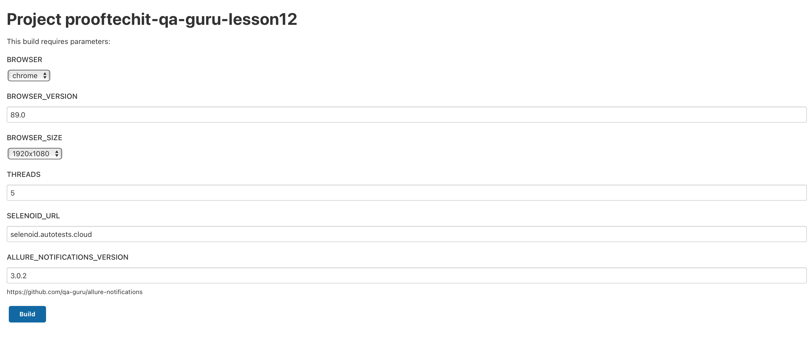

# Автотесты на **Prooftech IT**, [**https://www.prooftechit.com**](https://www.prooftechit.com)

## Стек и инструменты
Тесты написаны на Java + JUnit5 + Selenide + Gradle, запуск и прогон тестов через Jenkins + Selenoid с отчетами в Allure + Telegram

| Java | Gradle | Junit5 | Selenide | Jenkins | Selenoid |Allure Report | Telegram |
|:----:|:------:|:------:|:--------:|:-------:|:--------:|:------------:|:--------:|
|  |  |  |  |  |  |  |  |


## Запуск через [**Jenkins**](https://jenkins.autotests.cloud/job/prooftechit-qa-guru-lesson12/)

### Список параметров для запуска тестов в [**Jenkins**](https://jenkins.autotests.cloud/job/prooftechit-qa-guru-lesson12/):

* browser (по умолчанию chrome)
* browserVersion (по умолчанию 89.0)
* browserSize (по умолчанию 1920x1080)
* SELENOID_URL (url адрес selenoid)
* videoStorage (url address с видео)
* threads (количество threads)

### Скриншот страницы с выбором параметров сборки


## Запуск тестов из командной строки и формирование отчета в Allure
- Запуск тестов с параметрами по умолчанию:

Для Windows:
```bash
gradle clean test
```
Для MacOS:
```bash
./gradlew clean test
```

- Запуск тестов с указанными параметрами:

Для Windows:
```bash
gradle clean -DselenoidUrl=selenoid.autotests.cloud -DvideoStorage=https://selenoid.autotests.cloud/video/ -Dthreads=1 test
```
Для MacOS:
```bash
./gradlew clean -DselenoidUrl=selenoid.autotests.cloud -DvideoStorage=https://selenoid.autotests.cloud/video/ -Dthreads=1 test
```

- Формирование отчета в Allure:
```bash
allure serve build/allure-results
```

## Запуск и прогон тестов осуществляется в [**Selenoid**](https://selenoid.autotests.cloud/#/)

## Контакты
:writing_hand: :iphone: Telegram - [**@Leitirion**](https://t.me/leitirion)